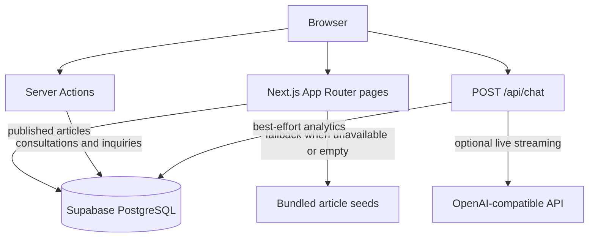

# Architecture and Operations

This document describes the implementation currently present in the repository. It is
intended for developers maintaining or deploying the Karachi legal practice website.

## System Overview

The application is a Next.js 16 application using the App Router and TypeScript. Public
pages are rendered from route components under `src/app`. Shared presentation is in
`src/components`; domain data, validation and integrations are in `src/lib`.



## Technology

- Next.js `16.3.2`, React `19.2.8`, TypeScript and Tailwind CSS v4.
- Supabase PostgreSQL with `@supabase/ssr` and `@supabase/supabase-js`.
- Server Actions for consultation and general inquiry submissions.
- Zod validation with React Hook Form for browser forms.
- An OpenAI-compatible streaming chat endpoint with a keyword-based offline fallback.
- Framer Motion for reveal animations, Lucide for icons, React Markdown for articles, and
  Sonner for notifications.

## Routes

| Route | Behavior |
| --- | --- |
| `/` | Home page with firm introduction, practice highlights, trust signals, statistics and testimonials. |
| `/about` | Firm, values, timeline and team information. |
| `/services` | Six practice-area index. |
| `/services/[slug]` | Practice-area detail, offerings, venues, FAQs and consultation form. Valid slugs are generated from `PRACTICE_AREAS`. |
| `/insights` | Published article list. The route is dynamic and reads Supabase or bundled seeds. |
| `/insights/[slug]` | Published Markdown article detail; missing articles use the normal not-found page. |
| `/contact` | Consultation booking, contact inquiry form, office details and embedded Google Map. |
| `/api/chat` | `POST` streaming legal-assistant endpoint. |

All pages receive the shared navbar, footer, chat widget and toast provider from
`src/app/layout.tsx`.

## Request and Data Flows

### Consultation booking

1. `ConsultationForm` collects client details, case category, preferred date/time and
   meeting type.
2. `consultationSchema` validates the payload, including Pakistani mobile format and a
   current-or-future date.
3. `submitConsultation` combines the date and slot into a timestamp.
4. With a configured service-role key, the action inserts a pending row into
   `public.consultations` and returns its generated `KLA-XXXXXXXX` reference code.
5. Without Supabase admin configuration, it returns a `KLA-DEMO-XXXXXX` reference without
   persisting data.

### General inquiry

`ContactForm` validates through `contactSchema` and calls `submitInquiry`. Production mode
inserts into `public.contact_inquiries`; demo mode returns success without persistence.

### Legal Insights

`getPublishedArticles` and `getArticleBySlug` use the server-side anon client when the two
public Supabase variables are configured. They only query articles whose
`published_at` is not null and is no later than the current time. If Supabase is missing,
errors, or returns no published rows, the functions use `src/lib/supabase/articles-seed.ts`.

### AI assistant

`POST /api/chat` accepts 1 to 24 messages, each containing a `user` or `assistant` role and
content up to 4,000 characters. The route keeps the last 12 messages, applies a best-effort
per-process IP limit of 30 requests per five minutes, and returns plain-text streaming
chunks.

When `GEMINI_API_KEY` is present, the route runs an [OpenAI Agents SDK](https://openai.github.io/openai-agents-js/) agent
(`src/lib/agent/`) pointed at Gemini's OpenAI-compatible endpoint
(`https://generativelanguage.googleapis.com/v1beta/openai/`, Chat Completions mode, tracing disabled):

- **Input guardrail** (`gemini-3.5-flash-lite` classifier) checks every turn for out-of-scope
  requests and jailbreak/prompt-injection attempts before the main model runs; tripped requests
  receive a canned refusal.
- **Agent** (`gemini-3.6-flash`, thinking capped via `reasoning_effort: low`) carries the firm
  persona, scope limits and disclaimer rules in its instructions, plus a `search_knowledge_base`
  function tool that performs semantic search (RAG) over `knowledge_chunks` in Supabase pgvector.
- Agent text deltas are re-emitted as plain-text streaming chunks; the wire format is unchanged.

If the run fails or no key exists, the route streams a local keyword-based response. Completed
turns are logged best-effort to `chat_logs` through the service-role client.

### Knowledge base ingestion

Markdown files in `knowledge-base/` are chunked by heading, embedded with `gemini-embedding-001`
(explicitly requested at 1536 dimensions — must match `vector(1536)` in
[`supabase/schema-vector.sql`](../supabase/schema-vector.sql)) and stored in Supabase via
pgvector cosine similarity. Re-index after edits with:

```bash
npm run ingest
```

## Configuration

Create `.env.local` in the project root. Environment files are ignored by `.gitignore` and
must not be committed.

| Variable | Required | Purpose |
| --- | --- | --- |
| `NEXT_PUBLIC_SITE_URL` | No | Canonical site URL; defaults to `http://localhost:3000`. |
| `NEXT_PUBLIC_SUPABASE_URL` | For persistence | Supabase project URL. Used by browser, server and admin clients. |
| `NEXT_PUBLIC_SUPABASE_ANON_KEY` | For article reads | Supabase public anon key used by the server/browser clients. |
| `SUPABASE_SERVICE_ROLE_KEY` | For form/chat persistence | Server-only key used by Server Actions, chat analytics and RAG retrieval. Never expose it to the browser. |
| `GEMINI_API_KEY` | No | Enables live agent chat. Missing key selects demo chat mode. |
| `GEMINI_BASE_URL` | No | Gemini OpenAI-compatible base; defaults to `https://generativelanguage.googleapis.com/v1beta/openai/`. |
| `GEMINI_MODEL` | No | Main chat model; defaults to `gemini-3.6-flash`. |
| `GEMINI_GUARDRAIL_MODEL` | No | Guardrail classifier model; defaults to `gemini-3.5-flash-lite`. |
| `GEMINI_EMBEDDING_MODEL` | No | Embedding model for RAG; defaults to `gemini-embedding-001`. |
| `GEMINI_EMBEDDING_DIMENSIONS` | No | Embedding output size; defaults to `1536`. MUST match `knowledge_chunks.embedding` in schema-vector.sql. |
| `GEMINI_REASONING_EFFORT` | No | Thinking level for the main model; defaults to `low` to cap hidden-token cost. |

Supabase article reads require the URL and anon key. Consultation, inquiry and chat-log
writes require the URL and service-role key. The application intentionally remains usable
in demo mode when these values are absent.

## Database

Run [`supabase/schema.sql`](../supabase/schema.sql) in the Supabase SQL editor. It creates:

- `consultations` for appointment requests and booking status.
- `contact_inquiries` for general messages.
- `articles` for published and draft Markdown content.
- `chat_logs` for anonymous assistant turns.
- `admin_users` and the `is_admin()` helper for administrator access.

For the chatbot's RAG knowledge base, also run
[`supabase/schema-vector.sql`](../supabase/schema-vector.sql) (enables pgvector, creates
`knowledge_chunks` with `vector(1536)` embeddings and the `match_knowledge_base` search RPC).
Then index the markdown files: `npm run ingest`.

The schema enables Row Level Security. Public clients can insert consultation requests,
inquiries and chat log rows; only authenticated admins can read or modify operational data.
Published articles are publicly readable, while article writes are admin-only. The current
application writes form data and chat logs with the service-role client from server code,
which bypasses RLS, so the service-role key must remain server-only.

To enable admin policies, first create a Supabase Auth user, then add that user ID to
`public.admin_users`:

```sql
insert into public.admin_users (user_id) values ('<auth-user-uuid>');
```

The schema also seeds three starter articles with an idempotent `on conflict (slug) do
nothing` insert.

## Local Development

```bash
npm install
npm run dev
```

Available scripts are defined in `package.json`:

- `npm run dev` starts the Next.js development server.
- `npm run build` creates a production build.
- `npm run start` serves the production build.
- `npm run lint` runs the ESLint configuration.

There is no automated test script or test directory in the repository, so behavior is
currently checked through linting, builds and manual browser flows.

## Deployment Notes

The repository contains Next.js configuration and a `vercel` ignore entry, but no CI/CD
workflow or deployment configuration that verifies a specific hosting provider. A hosting
target could not be verified from the available project files. At minimum, configure the
environment variables required for the desired persistence and chat behavior, run the
Supabase schema, and execute `npm run build` before deployment.

## Known Operational Boundaries

- The chat rate limiter is an in-memory `Map`, so limits are per Node.js process and are not
  shared across instances.
- Form acknowledgement is application-level; no email or calendar integration is present
  in the repository.
- Supabase service-role writes bypass database RLS by design and depend on server-only
  secret handling.
- The Google Map is embedded from a fixed URL in the contact page; no map API key is used.